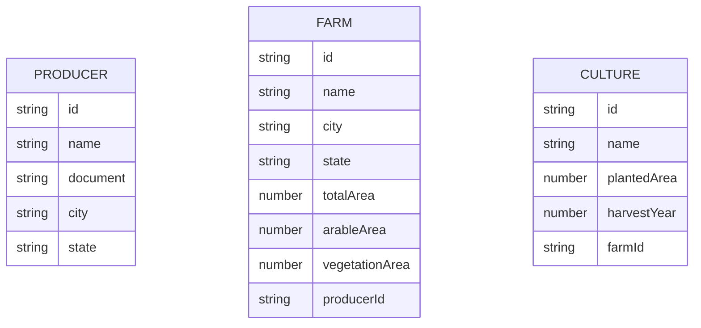

# Farm API

API para gerenciamento de fazendas desenvolvida com NestJS e Clean Architecture.

## 🚀 API Online

A API está disponível em: [https://farm-api-ks3k.onrender.com](https://farm-api-ks3k.onrender.com)

### Documentação da API
- Swagger UI: [https://farm-api-ks3k.onrender.com/api](https://farm-api-ks3k.onrender.com/api)

---

## 🛠️ Instruções de Instalação

1. **Clone o repositório:**
   ```bash
   git clone https://github.com/kenielnunes/farm-api.git
   cd farm-api
   ```
2. **Instale as dependências:**
   ```bash
   npm install
   ```
3. **Configure as variáveis de ambiente:**
   ```bash
   cp .env.example .env
   # Edite o arquivo .env conforme necessário
   ```
4. **Suba o banco de dados com Docker:**
   ```bash
   docker-compose up -d
   ```
5. **Execute as migrações:**
   ```bash
   npm run migration:run
   ```
6. **Inicie a aplicação:**
   ```bash
   npm run start:dev
   # ou para produção
   npm run build && npm run start:prod
   ```

---

## ⚙️ Configuração de Ambiente

Exemplo de `.env`:
```env
# Database
DB_HOST=localhost
DB_PORT=5432
DB_USER=seu_usuario
DB_PASSWORD=sua_senha
DB_NAME=farm_db

# Application
PORT=3000
NODE_ENV=development
JWT_SECRET=sua_chave_jwt
```

No Render, configure as variáveis de ambiente no painel do serviço.

---

## 📖 Exemplos de Uso

### Autenticação
- **POST /auth/login**
  ```json
  {
    "email": "admin@email.com",
    "password": "senha123"
  }
  ```
  Resposta:
  ```json
  {
    "accessToken": "...",
    "refreshToken": "...",
    "user": { "id": "...", "email": "...", "role": "Admin" }
  }
  ```

### Criar produtor rural
- **POST /producers**
  ```json
  {
    "name": "João Silva",
    "document": "12345678901",
    "city": "Uberlândia",
    "state": "MG"
  }
  ```

### Listar fazendas (paginado)
- **GET /farms?page=1&limit=10**

### Listar produtores (paginado)
- **GET /producers?page=1&limit=10**

### Exemplo de resposta do dashboard
- **GET /dashboard**
  ```json
  {
    "totalFarms": 12,
    "totalHectares": 3500,
    "byState": [
      { "state": "SP", "count": 5 },
      { "state": "MG", "count": 7 }
    ],
    "byCulture": [
      { "culture": "Soja", "area": 1200 },
      { "culture": "Milho", "area": 800 }
    ],
    "byLandUse": [
      { "type": "Arable", "area": 2000 },
      { "type": "Vegetation", "area": 1500 }
    ]
  }
  ```

---

## 🖼️ Diagramas

### Modelo de dados


---

## 🖼️ Arquitetura do sistema

O projeto segue o padrão **Clean Architecture**, separando responsabilidades em camadas bem definidas:

- **domain/**: Entidades de domínio e regras de negócio puras
- **application/**: Casos de uso (use cases), orquestram regras de negócio
- **infra/**: Implementações de repositórios, entidades do TypeORM, acesso a dados
- **presentation/**: Controllers, DTOs, validação e entrada/saída da API
- **shared/**: Código utilitário, exceções, filtros, interfaces comuns

### Organização de pastas (exemplo de um módulo)

```
src/modules/farms/
├── application/
│   └── usecases/           # Casos de uso (ex: create-farm.usecase.ts)
├── domain/
│   ├── entities/           # Entidades de domínio (ex: farm.entity.ts)
│   └── services/           # Serviços de domínio (regras complexas)
├── infra/
│   ├── entities/           # Entidades do TypeORM (mapeamento para o banco)
│   └── repositories/       # Implementações de repositórios
├── presentation/
│   ├── controllers/        # Controllers da API
│   └── dto/                # Data Transfer Objects (entrada/saída)
```
---

## 🤝 Contribuindo

1. Faça um fork do projeto
2. Crie uma branch para sua feature (`git checkout -b feature/AmazingFeature`)
3. Commit suas mudanças (`git commit -m 'Add some AmazingFeature'`)
4. Push para a branch (`git push origin feature/AmazingFeature`)
5. Abra um Pull Request


Link do projeto: [https://github.com/kenielnunes/farm-api](https://github.com/kenielnunes/farm-api)
